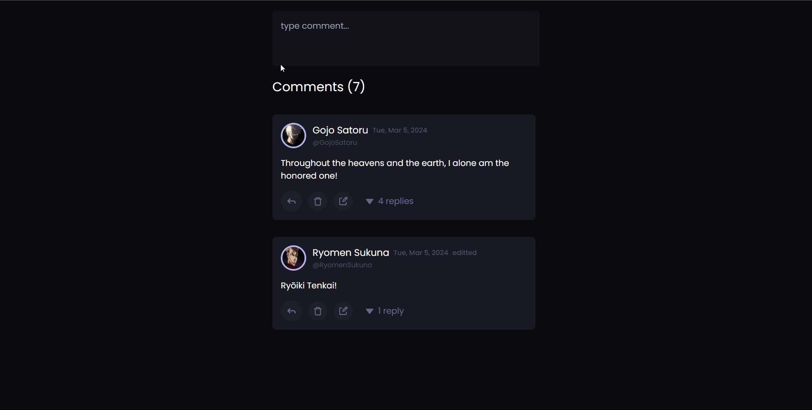

# Nested Comments Using React

A few things currently in progress

1. React Context API to eliminate prop drilling
2. Testing with Cypress/React Testing Library
3. Move comment box to bottom of screeen on mobile
4. Recursive comment count -- current count only counts the top level comments
5. Drop down to toggle replies
6. Use one comment box for both replies and top level comments. Having a nested reply box is not cool! (also show who the curren reply is being addressed to)
7. A comprehensive README (with GIF)

[Full Blog Post](https://dev.faddalibrahim.com/blog/using-recursion-to-create-nested-comments-system-ft-reactjs)

[Live Demo](https://nested-comments-react.netlify.app)

